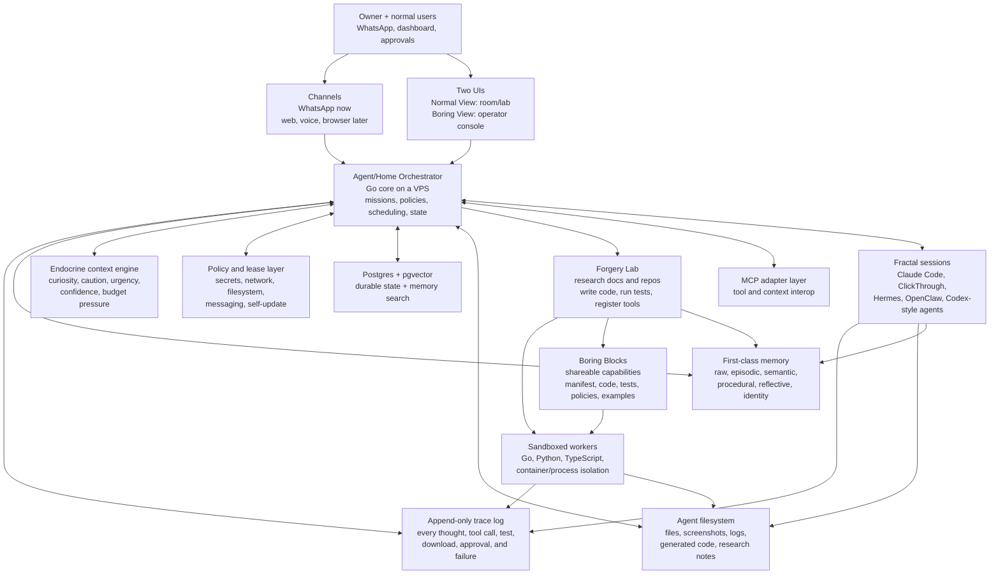

# Boring Agent

> Not another chatbot.
> A self-hosted agent home server that can remember, research, build, test, and improve its own tools.

## The thesis

Most agents are capped by the user's prompting skill, memory, workspace, and tools.

Boring Agent moves the bottleneck into a durable runtime:

- It has a home: a VPS with files, identity, memory, traces, policies, and dashboards.
- It has a body: channels, workers, tools, APIs, browser/computer-use adapters, and external runtimes.
- It has a lab: a sandbox where it researches missing capabilities, writes code, tests them, and packages them as Boring Blocks.
- It has memory that is more than RAG: episodes, facts, procedures, failures, identity, relationships, and control state.
- It has receipts: append-only traces make self-improvement inspectable instead of mystical.

## What makes it boring

The core is intentionally boring: Go, Postgres, Docker Compose, event logs, leases, tests, sandboxes, rollback.

The behavior is not boring: the agent can research its own gaps, forge new capabilities, remember what worked, attach to other runtimes, and keep improving without pretending the audit log is optional.

## One-line version

Boring Agent is an agent that lives on your server, builds its own tools, remembers across time, and lets you inspect every step.
